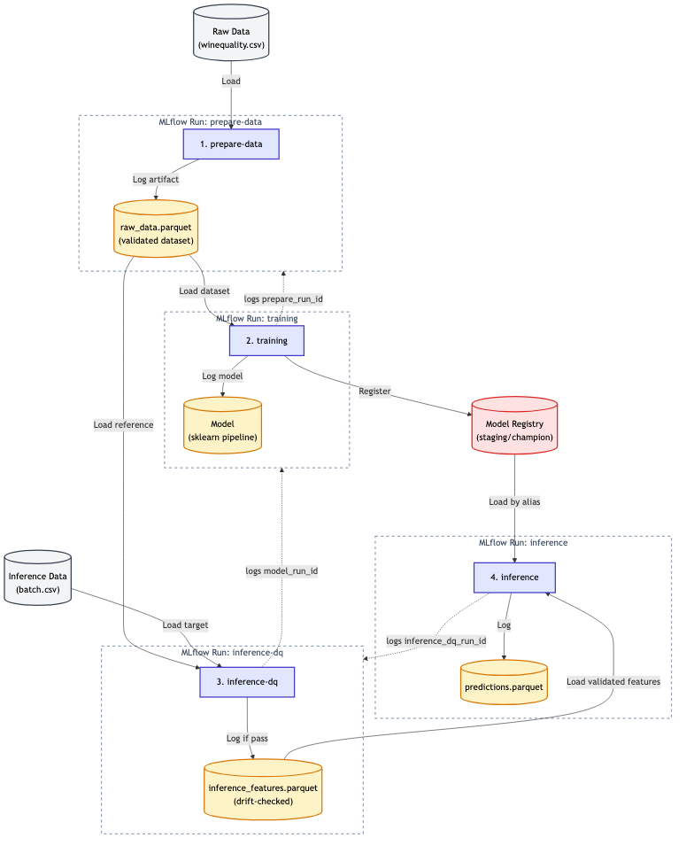

# Deployable Machine Learning Part 1: Architecture

> **TL;DR**: This post introduces a production-ready ML workflow with four sequential steps (prepare data, training, check drift, infer) using MLflow for lineage, Evidently for quality checks, and a CLI-based architecture. Each step creates immutable artifacts and maintains full auditability.

## About this series

This series demonstrates practical patterns for production ML workflows through a reference implementation. The approach is opinionated but flexible. If you see anything you like, feel free to borrow what works for your projects.

The series covers component interaction, design decisions, and practical MLOps patterns. I'm focusing on architecture and integration patterns, not tool-specific tutorials or hyperparameter optimization, as there are already great resources for those.

The implementation uses the wine quality dataset (https://archive.ics.uci.edu/dataset/186/wine+quality), concatenating both red and white wine samples into a single dataset, and Ridge regression. These choices keep the examples focused on architecture rather than model complexity, while still demonstrating production-ready patterns. The dataset contains only numeric features, and the goal is predicting quality scores from 0 to 10.

The repository is available to clone if you want to explore the implementation. This post covers the high-level architectural overview.

## Scope

The project targets **local batch deployment** with manually-triggered orchestration. Think cron jobs, not real-time APIs. This keeps things simple while still being production-ready.

**Full auditability** is non-negotiable. I want complete model lineage that tracks training data, model objects, validation results, and inference data. This has saved me countless times when someone asks "Can you reproduce what we predicted six months ago?" while the codebase has changed ten times over.

For data quality, I'm building in two critical capabilities. **Data quality gates** give us the ability to flag training data issues and decide whether to train the model or skip training entirely. Bad data is the bane of machine learning, and I've heard "garbage-in, garbage-out" more times than I can count. Talk is cheap; quality gates are what actually matter.

The second quality capability is **drift detection**. The world changes constantly, and so does data. Rules inferred by a model trained on last month's data may not perform well on new data, so we need the ability to flag and block inference when drift is detected.

On the technical side, I want **reasonable genericity**, generic enough to adapt to different use cases within scope without becoming a Swiss Army knife that does nothing well. And finally, **developer-friendly configuration** with IDE support and type safety. Handling nested structures manually is overhead I don't want to invest in. It costs time and harms developer experience.

## The Stack

Here's the stack and reasoning behind each choice:

**Pandas** for data manipulation. The standard for ML projects in Python. While Polars and Spark excel at massive scale, pandas integrates seamlessly with scikit-learn (and other major tools) and provides everything needed here.

**Evidently** for data quality checks and drift detection. Provides minimal setup and produces useful HTML reports. I'll use it for training data quality checks and drift detection before inference.

**scikit-learn** for machine learning. The gold standard for composable ML pipelines. Its philosophy of consistency and composability makes it elegant and scalable when used properly.

**MLflow** for lineage and tracking. Handles experiment tracking, lineage, and model registry out of the box. Implementing this from scratch would be significant overhead. It enables full model lineage: training data, data quality results, model artifacts, inference drift, and inference data. This creates a complete audit trail that's invaluable in both production and experimentation.

**Typer** for CLI. Simple, intuitive CLI framework from the FastAPI author. Provides Pydantic type safety that matches our configuration approach.

**uv** for dependency management. Fast, modern package manager. Not strictly necessary but significantly speeds up dependency resolution during development.

## Architecture

### Repository structure
```
wine-quality-mlops/
├── config.yaml                # Configuration file (Pydantic + YAML)
├── pyproject.toml             # Dependencies and configuration
├── README.md                  # This file
├── CLAUDE.md                  # Developer guide for Claude Code
├── data/
│   └── raw/                   # Wine quality CSV files
├── mlruns/                    # MLflow tracking directory (gitignored)
└── src/
    └── wine_quality_mlops/
        ├── __init__.py        # Package initialization
        ├── config.py          # Pydantic configuration manager
        ├── data.py            # Data loading and splitting
        ├── modeling.py        # Pipeline, training, optimization, evaluation
        ├── visualization.py   # Plot generation (4 plots)
        ├── utils.py           # Utility functions for MLflow, Evidently, run management
        └── cli.py             # Typer CLI (prepare-data, training, inference, inference-dq)
```

### Complete Workflow

End-to-end workflow consists of four sequential steps that work together to ensure data quality, model training, drift detection, and inference. Each step creates an MLflow run that stores artifacts (anything you can save locally: models, data, figures, and more) and maintains lineage through explicit run ID references. Additionally, trained models are automatically registered to MLflow's Model Registry for version control and alias-based serving. The diagram below illustrates the complete workflow, showing how different runs reference each other, how artifacts are reused across the pipeline, and how models flow into the registry.

> **Diagram Legend:** The diagram uses a two-column layout separating the Data Preparation Path (left) from the Inference Path (right). Boxed groups represent **MLflow Runs**, containing both the command execution and the artifacts they log. Solid arrows show physical data flow (loading/logging artifacts). Dotted arrows show lineage tracking via run ID parameters (e.g., "logs prepare_run_id"). Yellow cylinders represent immutable artifacts. The Model Registry box shows version management and alias-based serving.



### Diagram elaboration

The pipeline is organized into two main paths: the Data Preparation Path (left column) and the Inference Path (right column). Each path contains steps that build on previous outputs.

**Prepare Data** starts the Data Preparation Path. We load raw data from CSV files, normalize data types for consistency, and run Evidently quality checks. The validated dataset gets logged as a `raw_data.parquet` artifact in an MLflow run, becoming the single source of truth for everything downstream.

**Training** completes the Data Preparation Path. It references the prepare-data run via the `prepare_run_id` parameter (shown as a dotted arrow). If you don't provide one, it automatically finds the most recent tagged run. From there, it loads the `raw_data.parquet` artifact, splits into train/test sets, optimizes hyperparameters with Optuna, trains the model, and logs everything: the trained model, evaluation metrics, and visualizations.

**Inference Data Quality** begins the Inference Path as your safety check before predictions. It references the training run via the `model_run_id` parameter (dotted arrow) to locate the exact training data used for the model, ensuring a valid baseline for drift comparison. It loads that same `raw_data.parquet` artifact used during training and compares the inference data against it using Evidently's drift detection. Only if drift checks pass does it log the validated inference features as `inference_features.parquet`.

**Inference** completes the Inference Path where predictions finally happen. It references the inference-dq run via the `inference_dq_run_id` parameter (dotted arrow), resolves the model via the Model Registry by alias (typically "champion"), loads validated features from `inference_features.parquet`, generates predictions, and logs them as `predictions.parquet`.

### Model Registry Integration

In addition to the four-step pipeline, the system integrates MLflow's Model Registry for model versioning and serving. Here's how it works:

**Automatic Registration** kicks in as soon as training completes. The model gets automatically registered to the Model Registry under the name `wine_quality_regressor`, with each training run creating a new version (version 1, 2, 3, etc.). By default, new models are tagged with the "staging" alias, signaling they're ready for validation but not yet production-approved.

**Alias-Based Serving** replaces the nightmare of tracking cryptic run IDs. Instead of remembering "run_abc123def", you load models by alias: "staging" for newly trained models, "champion" for production-approved ones. The inference step defaults to loading the "champion" model, but you can explicitly override this with `wine-quality inference --model-alias staging` when testing.

The **promotion workflow** is deliberately manual. New models start with the "staging" alias automatically, but promoting to "champion" requires explicit action via the MLflow UI or API. This creates a clear separation between experimental models and production models. You can't accidentally deploy an untested model to production.

**Why does this matter?** Four key reasons. First, it provides **version control**. Every trained model is versioned and traceable. Second, it enables **safe deployment**. That staging-to-champion promotion acts as a quality gate that prevents untested models from reaching production. Third, you get **rollback capability**. Previous versions remain accessible via the registry, so if something goes wrong, you can roll back instantly. And finally, there's **no run ID juggling**. You load models by semantic alias ("champion") instead of cryptic run IDs like "run_7a8f23bc".

This pattern is particularly valuable in production where you want to decouple model training from model serving. You can train multiple models daily but only promote the best performers to champion.

### Key Design Patterns

**Run References and Lineage** work through explicit parameter passing (shown as dotted arrows in the diagram). Each run references previous runs via parameters like `prepare_run_id`, `model_run_id`, and `inference_dq_run_id`. These parameters create a clear lineage chain that you can trace through MLflow's UI. And here's the clever part: if you don't provide run IDs explicitly, the system automatically falls back to the most recent run tagged as "active" for that step type. Convenience without sacrificing traceability.

**Artifact Reuse** is what makes the pipeline efficient. The `raw_data.parquet` artifact from the prepare-data run gets reused in both training and inference-dq runs (arrows crossing run boundaries). The trained model is registered to the Model Registry and loaded by inference via alias lookup. The `inference_features.parquet` from inference-dq gets reused in inference. All artifacts are referenced using MLflow's `runs:/{run_id}/artifact_name` URI format, which ensures immutability. Once logged, an artifact never changes. This gives you reproducibility by default.

**Quality Gates** protect you at two critical points. First, **data quality checks** in prepare-data can stop the entire pipeline if thresholds are exceeded (like max allowed test failures). Second, **drift detection** in inference-dq acts as a gate before inference is allowed. If the new data looks too different from training data, predictions get blocked. Both use Evidently reports that are logged as HTML artifacts, so you can inspect exactly what triggered the gate.

One note: this reference implementation intentionally omits automated **model quality gates** (like "only register if MAE < X") to keep focus on core MLOps patterns. In production, you'd typically add business-specific quality thresholds before promoting models from staging to champion, but I've left that out to avoid cluttering the architecture with domain-specific logic.

The **Active Tag System** is what makes automatic fallback possible. Each step can tag its run with a status (like `status=active-training`), which enables automatic discovery of the latest "active" run when you don't provide explicit run IDs. This gives you flexibility for manual orchestration while maintaining clear lineage. You can be lazy about run IDs during experimentation, but when you need to reproduce something specific, the lineage is still there.

**Configuration** is deliberately simple: a single `config.yaml` file serves as the single source of truth. This configuration gets parsed and validated with Pydantic, which gives you full IDE support with autocomplete and type checking.

### Example: Running the Pipeline
Here's what the workflow looks like in practice. Each step is a CLI command:

**Step 1: Prepare and validate data**
```bash
wine-quality prepare-data
```

**Step 2: Train model**
```bash
wine-quality training
```

**Step 3: Check inference data for drift**
```bash
wine-quality inference-dq --inference-data-path data/raw/new_batch.csv
```

**Step 4: Generate predictions**
```bash
wine-quality inference                        # Uses champion model
wine-quality inference --model-alias staging  # Or use staging model
```

The configuration is defined in a single `config.yaml` file:
```yaml
data:
  path: "data/raw/wine_quality.csv"
  target_column: "quality"
  test_size: 0.2

model:
  type: "Ridge"
  quality_score_min: 0
  quality_score_max: 10

mlflow:
  experiment_name: "wine_quality_regression"
  tracking_uri: "mlruns"
  model_name: "wine_quality_regressor"  # Model Registry name
```

*(Simplified example; full config includes optimization, data_quality, and default_tags sections. See repository for complete config.yaml)*

This configuration is parsed and validated with Pydantic, providing full IDE support and type safety.

### Deployment considerations
When deploying to production, you'll need to adapt a few things depending on your platform. You'll connect to a remote MLflow server instead of the local `mlruns` directory, connect to cloud data sources like S3 or Azure Blob instead of local files, deploy to different environments (dev, staging, prod), set up monitoring and alerting, and adapt orchestration for your particular purpose.

The good news: adaptations to the core code and logic would be minimal. The pipeline is designed for manual, batch-oriented orchestration where each step can be triggered independently. This makes it straightforward to integrate with cron jobs, Airflow, or CI/CD pipelines. Whether you're using Databricks, SageMaker, Azure ML, or custom deployments with Docker/Kubernetes, the CLI-based structure adapts easily.

## Conclusion

This architecture demonstrates one approach to structuring ML code for production deployment. A few key takeaways from this implementation:

**Lineage matters.** Using MLflow to track data, models, and artifacts creates an audit trail that's invaluable when debugging production issues. I can't count how many times this has saved me when someone asks "What data did we use for that prediction three months ago?"

**Quality gates prevent problems.** Data quality checks and drift detection catch issues before they impact predictions. It's much better to block a bad prediction than to explain why your model went haywire in production.

**Artifact reuse ensures consistency.** Reusing validated artifacts across steps prevents data inconsistencies. When inference uses the exact same processed data format that training validated, you eliminate an entire class of bugs.

**Simple orchestration is underrated.** Manual, step-by-step orchestration makes it easy to integrate with existing infrastructure. Whether you're using cron, Airflow, or CI/CD pipelines, CLI commands are universal.

The next posts in this series cover specific patterns in depth: configuration management, data validation and drift detection, scikit-learn pipelines, and MLflow lineage tracking.

The repository is available at [https://github.com/tsuhina/blog_deployableml](https://github.com/tsuhina/blog_deployableml). I'm curious what patterns you've found most useful in your ML deployments. Drop your thoughts in the comments.

## In Part 2

Part 2 covers configuration management: structuring YAML configs, validating them with Pydantic, and getting full IDE support for better developer experience.